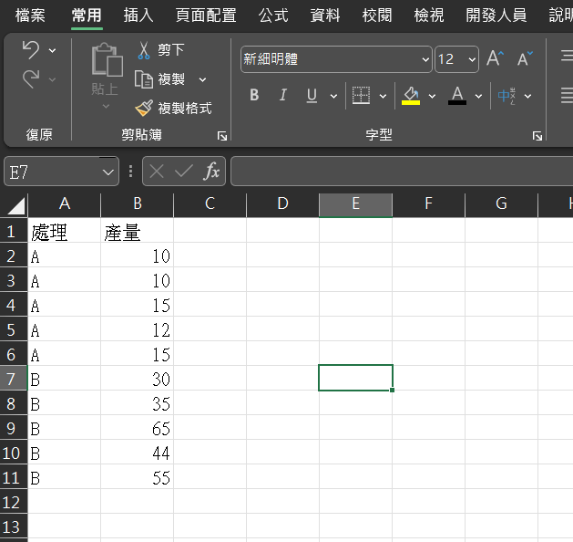

# 敘述統計

這一章節的目的是介紹如何讀取資料，將資料進行簡單的統計量計算分析，例如平均值、樣本變異數、樣本數等等。

## 資料格式

統計分析的資料，以 Excel 檔整理成以下格式，並統一存成 UFT-8 編碼的 csv 檔。

csv 檔可以用 Excel 檔開啟，因此，一旦將寫在紙上的原始資料 (raw data) 輸入到 Excel 中，再轉存成 .csv檔，就可以直接由 R 讀取，相當方便。



這樣的資料在R裡面會長這樣：

```{r echo=FALSE}
(df<-data.frame(
  '處理' = rep(c('A','B'),each=5),
  '產量' = c(10,10,15,12,15,30,35,65,44,55)
))
```

上方印出的東西稱為資料表 (dataframe)，

資料表由2個變數 (variables) 組成，`處理`和`產量`；

變數名稱所在的位置稱為欄位 (columns)，

欄位是有順序的，在上表中，第1欄為`處理`、第2欄為`產量`。


每個欄位下面都有資料值 (values)，稱為觀測值 (observations)，

觀測值左方的數字為列 (row) 數，可以看到這筆資料有2欄10列。

若細究資料表的結構，其實他的2個欄位是由2個有名稱的向量組成。

在開始前，請下載[`此檔案`]( )，將其存放在 D 槽，以利後續分析。


## 讀取資料

使用`read.csv`函數
```{r}
iris_df <- read.csv( file = 'D:/iris.csv' )
```

上方指令的意思是，讀取 csv 檔(`read.csv`)，檔案放在D槽底下，名稱為iris.csv (`file = 'D:/iris.csv'`)

讀取完之後，在 R 的環境中，我想要幫這個資料表取名為`iris_df` ( iris_df <- )


這裡有些細節要交代：

1. 箭頭 (<-) 在 R 中是代表賦值 (assign) 的操作子 (operator)，意思是把"箭頭右方"的物件，取代"箭頭左方"的物件。如果左方的物件是空的，那他就會是箭頭右方物件的新名字。（從今天開始你的代號就是9527！）

2. 取名的時候，要注意規則統一。好的命名原則有兩個：
  - 底線: 例如 my_data、iris_df、rice_yield，兩個全為小寫的單字以底線區隔
  - 駝峰: 例如 myData、irisDf、riceYield，兩個小寫的英文單字，但第二個單字開頭開小


## 


