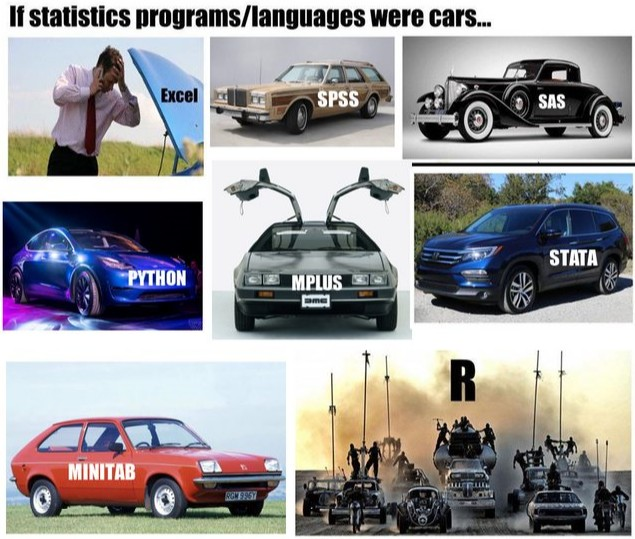
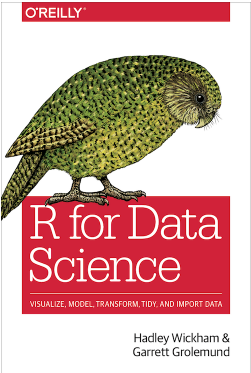
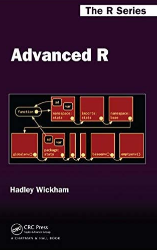
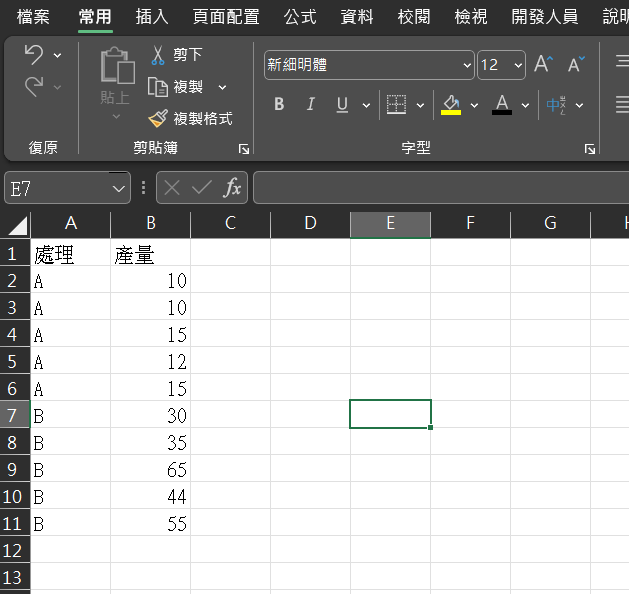
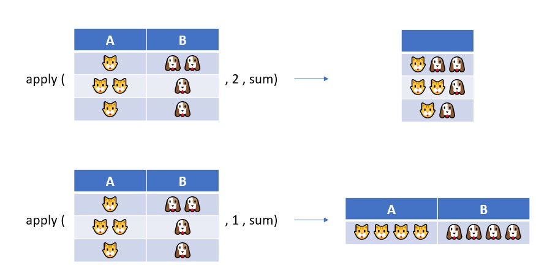

# 這是什麼?


* 這是一個用R來做試驗設計與分析的學習筆記，程式碼的速查本，包含農業研究常用的試驗設計學的 R 程式語言，要讀懂這本書，基礎的試驗設計學知識是必須的。


本書使用到的套件，複製到R環境執行即完成安裝與啟用：
```{r message=FALSE, warning=FALSE, include=TRUE}
pkgs <- c('car','MASS','magrittr','tidyverse','lme4','lmerTest','multcomp','agricolae','dplyr','lsmeans','emmeans','psych')
if (!any(pkgs %in% installed.packages())) {install.packages(pkgs[!pkgs %in% installed.packages()])}
invisible(lapply(pkgs , library , character.only=TRUE))
```


本書的R版本
```{r echo=FALSE, warning=FALSE}
sessionInfo()
```

```{r include=FALSE}
# automatically create a bib database for R packages
knitr::write_bib(c(
  .packages(), 'bookdown', 'knitr', 'rmarkdown'
), 'packages.bib')
library(formatR)
library(knitr)
```

<!--chapter:end:index.Rmd-->

# 為什麼要用R?

以下引用Advanced R的[Why R](https://adv-r.hadley.nz/introduction.html)，說明使用R的好理由:

-   R完全免費而且開源。

-   R的社群相當多元而且樂於討論。

-   R有大量的統計分析、機器學習、數據視覺化、資料整理套件，任何想做的數據分析，幾乎已有人寫好程式碼與教學。

-   R也有工具可以分享結果，例如[RMarkdown](https://rmarkdown.rstudio.com/)可以將資料分析結果輸出成文件、簡報、動態網頁；[Shiny](https://shiny.rstudio.com/gallery/)可以製作精美的互動網站。

-   R包含最先進的統計分析與機器學習工具，而且不斷進化。

-   RStudio公司開發好用的R工具並販售，然而，現在已經將獲利逐漸回饋給R的公共社群。其中50%的工程師在RStudio做的是開放原始碼的專案。

-   R學習難度低、上限高，甚至可以在R中利用C、Fortran、C++語言加速程式執行流程。


---


但R也有缺點，例如

-   多數R使用者並非專業軟體工程師，許多野生的R程式碼都是為了快速解決問題而寫，不優美而且難懂。

-   R的社群更專注在分析過程及結果，對達成軟體工程的知識實踐是零散的。例如沒有足夠多的R程序員使用源代碼控制(source code control)或自動化測試(automated testing)。

-   太多的 R 函數使用技巧來減少輸入程式碼，導致程式碼難以理解，並且可能以意想不到的方式失敗。

-   R 的程式語言包(packages)品質不一，有太多的特殊情況需要記住，導致每次使用 R ，你都會面臨超過 25 年的演變，這會使學習 R 變得困難。

-   相較其他程式語言，R 執行效率低而且耗用電腦資源，糟糕的 R 程式碼可能會執行速度很慢。


{width="500"}[from reddit](https://www.reddit.com/r/rstats/comments/dn7fa7/i_thought_the_if_stats_programs_were_cars_meme/)

## 下載與安裝R

下載與安裝

[R](https://cran.r-project.org/)


[RStudio](https://posit.co/download/rstudio-desktop/)


R是必須要安裝的，否則沒辦法使用。RStudio則是R語言的"整合開發環境' (Integrated Development Environment, IDE)。


[這裡](https://joe11051105.gitbooks.io/r_basic/content/environment_settings/RStudio_introduction.html)有更詳細的RStudio環境介紹。


## 第一個R程式碼

複製下面程式碼，貼上至R console，按下Enter；或是在 RStudio 中開啟新的script，貼上程式碼將輸入游標在同行按Ctrl+Enter。

這是你的第一個R程式碼，嗨，世界!


```{r echo=TRUE}
print('Hello world!')
```


以下章節都會包含程式碼 (灰框上方) 與執行結果 (灰框下方)，灰框右上方有複製按鈕，點選就可以直接複製程式碼，貼上在R介面中執行。


你會發現，R很像是Google助理，輸入一行指令，執行後就會返回一行結果，這種一來一往式的程式語言叫做直譯語言(interpreted language)。但一段 R 的程式碼可能會有很多行，譬如下面畫圖的函數，就包含許多行程式碼。 　 　


### 第一張圖

你可以將下面程式碼複製後，整個貼到你的RStudio介面或是R中執行，畫出你的第一張圖：

```{r echo=TRUE, message=FALSE, warning=FALSE}
pkg <- 'ggplot2'
if ( !pkg %in% installed.packages()) install.packages(pkg) 
library(ggplot2)
ggplot(data = iris, mapping = aes(x = Sepal.Length, y = Petal.Width, color = Species))+
  geom_jitter()+
  geom_smooth(method='lm',se=F)+
  theme_bw()+
  labs(x='花萼長度(cm)',
       y='花瓣寬度(cm)',
       color = '品種',
       title = '鳶尾花花萼長與花瓣寬線性關係')
```

上面是利用`ggplot2`套件和內建資料`iris`畫成的圖，後面章節會介紹如何畫圖。

像`iris`這樣的資料集，在安裝好R的當下就已經同時安裝好，我們稱為[範例資料集](https://stat.ethz.ch/R-manual/R-devel/library/datasets/html/00Index.html)，可以用`data()`查看有哪些可利用的資料集。

## 學習地圖(Roadmap)

現在許多R的教程會直接建議從{tidyverse}學起，譬如以下這篇訪問，RStudio創辦人 J.J. Allaire(簡稱JJ)接受 Joseph B. Rickert(簡稱JBR)[訪問](https://cosx.org/2016/11/interview-j-j-allaire/)也提到這一點。

---
```
JBR: 對於初次接觸 R 的人，您有什麼建議嗎？無論是學生、經驗豐富的統計學家還是研究人員？

JJ: 我會建議他們練習一下 Hadley Wickham 和 Garrett Grolemund 在 [“R for Data Science”](https://r4ds.had.co.nz/index.html) 這本書中的寫的 R 程式碼。這本書詳細說明了在 R 中處理資料的 tidyverse 和基本原則。R 中有很多很好的工具，但並不是每個用 R 的人都能立刻找到這些工具。這正是我們試圖改變的。我還建議 R 的新手仔細看看我們在 RStudio 開發的所有工具和包。

此外，當你有問題或遇到問題千萬不要放棄。在 StackOverflow 和其它地方有很多很有用的關於 R 的資訊，如果你仔細看它們的話，你有機會找到你的問題的答案。

JBR: 您認為統計學家和資料科學家大體上應該知道哪些關於電腦科學的知識呢？

JJ: 這是個有趣的問題。許多關於 R 的最普遍的看法和思考都圍繞著 Bo Cowgill 那著名的言論：“R 最好的地方在於它是由統計學家編寫的，R 最糟的地方也在於它是由統計學家編寫的。” 

然而事實上，R 的開發者們對程式設計和電腦科學相當瞭解。他們的目標一直都是提供一個讓掌握很少的電腦科學知識的人能實現想法的表示式語言。R 努力提供一種介面和語法，使得不懂電腦科學的人也可以使用 R 做一些複雜的資料分析。

我認為總會存在一些不能用高級的指令解決的問題。所以學習基本的程式設計原則，做一些簡單的計算或者文字分析和語法分析這之類的事是有用的，但是 R 的重點還是不強迫每個人都成為電腦科學家。
```

---

### 參考書

我買過R跟Python的參考書，但我認為R語言奠基在一個不斷進化的基礎上，而且最好的R語言參考書正是以Git book電子書的形式免費發行在網路上供人閱讀，因此花錢買書並不太划算。

這邊提供一些有名的參考書。


-   [R for Data Science](https://r4ds.had.co.nz/index.html) by Hadley Wickham and Garrett Grolemund。 [Hadley Wickham](https://hadley.nz/)是[RStudio](https://posit.co/download/rstudio-desktop/)的工程師，基本上也是R語言的耶穌。他讓R語言變得更容易使用，這本書介紹R資料科學，也是我的第一本教科書。
-   [R for Data Science 第二版](https://r4ds.hadley.nz/) 好書的第二版一定也是好書(🦐挺起來)。

{width="200"}


-   [Advanced R](https://adv-r.hadley.nz/introduction.html) 當你有一段三行以上的程式碼要一再複製貼上重複使用，就要考慮使用函數。這本書介紹除了函數編程(functional programming)以外也介紹R的物件導向編程(object-oriented programming)


{width="200"}


-   [阿好伯的文章](https://hackmd.io/@LHB-0222/LearningR?type=view#) 中文且品質非常好的文章!

-   [知乎](https://zhuanlan.zhihu.com/p/143005986) 中國的知識家，和臺灣的知識家水準完全不一樣，有非常多高參考價值的文章值得一讀。


---


有結果後就可以準備輸出，這時可以用R忍者[謝益輝](https://yihui.org/cn/vitae/)開發的套件，下面是這些套件的使用說明書：

-   [RMarkdown Cookbook](https://bookdown.org/yihui/rmarkdown-cookbook/)


{width="200"}


-   [bookdown: Authoring Books and Technical Documents with R Markdown](https://bookdown.org/yihui/bookdown/)


{width="200"}


另外是{RMarkdown}的替代方案[Quarto](https://quarto.org/)，可以用來產生簡潔易懂的程式碼與報告。


[R for Data Science 第二版](https://r4ds.hadley.nz/)也有專文介紹[Quarto](https://r4ds.hasdley.nz/quarto.html)。


-   [資料科學與R語言](http://yijutseng.github.io/DataScienceRBook/index.html) by 曾意儒老師，中文版免費的R教科書。

-   [TIDY MODELING WITH R](https://www.tmwr.org/) 有關資料建模。

-   [Bookdown Gallery](https://bookdown.org/)利用Bookdown建立的好書網站。


<!--chapter:end:01-intro.Rmd-->

# 敘述統計

這一章節的目的是介紹如何讀取資料，將資料進行簡單的統計量計算分析，例如平均值、樣本變異數、樣本數等等。

## 資料格式

統計分析的資料，以 Excel 檔整理成以下格式，並統一存成 UFT-8 編碼的 csv 檔。

csv 檔可以用 Excel 檔開啟，因此，一旦將寫在紙上的原始資料 (raw data) 輸入到 Excel 中，再轉存成 .csv檔，就可以直接由 R 讀取，相當方便。



這樣的資料在R裡面會長這樣(不建議在資料表中輸入中文字)

```{r echo=TRUE}
(df<-data.frame(
  '處理' = rep(c('A','B'),each=5),
  '產量' = c(10,10,15,12,15,30,35,65,44,55)
))
```

上方印出的東西稱為資料表 (dataframe)，資料表由2個變數 (variables)處理與產量組成。變數名稱所在的位置稱為欄位 (columns)，欄位是有順序的，在上表中，第1欄為處理、第2欄為產量。每個欄位下面都有資料值 (values)，稱為觀測值 (observations)，觀測值左方的數字為列 (row) 數，可以看到這筆資料有2欄10列。

在開始前，請下載[此檔案](/dataset/iris.csv)，將其存放在D 槽底下。

## 讀取資料

使用`read.csv`函數

```{r eval=FALSE, message=FALSE, warning=FALSE, include=FALSE , error = F}
iris_df <- read.csv( file = 'D:/iris.csv' )
```

上方指令的意思是，讀取 csv 檔，檔案放在D槽底下，名稱為iris.csv (`file = 'D:/iris.csv'`)，而我想要幫這個資料表取名為`iris_df`

箭頭 (\<-) 在 R 中是代表賦值 (assign) 的操作子 (operator)，意思是把"箭頭右方"的物件，放入"箭頭左方"的物件中。

如果左方物件(iris_df)是全新的、沒有指派物件的東西，執行程式碼之後，箭頭右方的物件(`read.csv( file = 'D:/iris.csv' )`)就會變成左方的名稱。（從今天開始你的代號就是9527！）

```{r}
快龍的招式 <- '破壞死光'
快龍的招式 <- '千變萬花'
print(快龍的招式)
```

另外，使用`file.choose()`可以指定檔案的路徑，配合`read.csv`可以不輸入太多東西的情況下讀取檔案
```{r  eval=FALSE , message=FALSE, warning=FALSE, include=FALSE , error = F}
data <- read.csv(file.choose())
```

2.  物件命名有兩個主要規則：

-   底線：例如 my_data、iris_df、rice_yield，兩個全為小寫的單字以底線區隔
-   駝峰：例如 myData、irisDf、riceYield，兩個小寫的英文單字，但第二個單字開頭為大小字母。

## 敘述統計量表

產生敘述統計量表格的方式應該有千萬種，這邊介紹2種方法。

{psych} 套件的 `descrieBy`和`describe`

1.  安裝 {psych} 並啟用

```{r message=FALSE, warning=FALSE, include=FALSE , error = F}
# 檢查有無安裝，若無則繼續安裝套件
if('psych'%in%installed.packages() == FALSE) install.packages('psych')

# 啟用
library(psych)
```

2.  輸入`describe`

```{r}
# 產生敘述統計表
# 使用範例資料集 mtcars (一個車子雜誌的資料)
psych::describe (mtcars)
```

這裡你可能會覺得疑惑，報表內的`median`我還看得懂是中位數，那`trimmed`是什麼? 切碎的蠍子嗎?

當對函數的功能有疑惑時，只要在函數前面輸入 `?` 再執行，就可以讀取該函數的說明文檔。

文檔內會包含使用函數的方式、函數吃什麼參數、會吐什麼樣的結果、以及程式碼範例。在文檔中可以找到 "trim=.1 -- trim means by dropping the top and bottom trim fraction"，也就是去掉數據最大值與最小值後取的平均值。

```{r eval = FALSE , message=FALSE , warning = FALSE}
?describeBy
```

3.  分組敘述統計與輸出

上表計算所有變數(mpg, cyl, disp...)的敘述統計量。如果要計算手排或自排 (vs = 1,0) 及汽缸數 (cyl = 4,6,8) 不同組合的敘述統計量，就要用到分組。

我最常使用`tidyverse`來進行分組計算。

啟用套件

```{r error= FALSE, warning=FALSE , message= FALSE}
pkg<-'tidyverse'
if(pkg %in% installed.packages() == F) install.packages('tidyverse')
library(tidyverse)
```

產生分組敘述統計表。

```{r warning = FALSE ,message=FALSE}
mtcars %>% 
  group_by ( vs , cyl ) %>% 
  summarise( across ( where( is.numeric) , list('avg'=mean, 'sd'= sd ))) %>% 
  round(digits = 2)
```

這邊用到的是`tidyverse`中`dplyr`和`magrittr`套件的數個功能。

-   `%>%`: 管線子(pipe)

執行一次分析，會用到非常非常多函數`f(x)`，下意識可能會這樣寫。

```{r tidy = TRUE}
# 產生100個隨機數字
x <- rnorm (100)
# 取絕對值(abs)、開根號(sqrt)、四捨五入到小數點後第二位(round)、顯示前6筆
x1 <- abs(x)
x2 <- sqrt(x1)
x3 <- round(x2 , digits = 2)
head(x3)
```

或是這樣，這是所謂的巢狀函數。

```{r eval=FALSE}
# 產生100個隨機數字、取絕對值(abs)、開根號(sqrt)、四捨五入到小數點第二位、顯示前6筆
head(round(sqrt(abs(rnorm (100))),2))
```

這樣寫起來既冗且不清楚，但用管線子可以讓代碼看起來比較清晰好懂。

```{r eval = FALSE}
rnorm (100) %>% 
  abs %>% 
  sqrt %>% 
  round( . , digits = 2) %>% 
  head
```

-   `%>%`將資料由左往右傳
-   `.`代表左方傳入物件的位置
-   `%>%` 右方的函數可不加括號
-   行與行之間用 Enter 換行，看起來比較舒服
-   在 RStudio 中，`%>%`輸入快捷鍵是ctrl+shift+m

2.  `group_by( 分組變數A , 分組變數B , ... )`

3.  `summarize( across ( 條件判斷 , list ( 敘述統計函數1 , 敘述統計函數2 )))`


最後使用`write.csv`將資料分組計算後輸出
```{r eval=FALSE, message=FALSE, warning=FALSE}
mtcars %>% 
  group_by ( vs , cyl ) %>% 
  summarise( across ( where( is.numeric) ,
                      list('avg'=mean, 'sd'= sd ))) %>% 
  round(digits = 2) %>% 
  write.csv(., 'D:/summary.csv')
```


<!--chapter:end:02-describe.Rmd-->

# 平均值檢定


## 利用t檢定比較兩個族群平均值

在分析實驗結果時，我們最關切的問題，應屬"平均值之間是否有差異"。比較兩個平均值的差異，可以用t檢定；超過兩組平均值的比較，可用` (analysis of variance, ANOVA) 來檢定各組平均是否有差異。


### 資料下載

本筆資料為riceYield，係由亂數產生，下面這個程式碼只要執行一次就好。
```{r}
# 產生亂數資料
riceYield<-data.frame(
  'treatment' = (rep(c('A','B'),each=10) ),
  'yield' = c(rnorm(n = 10 , mean = 5000 , sd = 400),rnorm(n=10 , mean = 6500 , sd = 400)
))
```


現在來看看這筆資料長怎樣：
```{r eval=FALSE}
# 查看 前 10筆資料
head(riceYield)
```


```{r echo=FALSE}
head(riceYield)
```

```{r eval=FALSE}
# 查看 後 10筆資料
tail(riceYield)

```

```{r echo=F}
# 查看 後 10筆資料
tail(riceYield)
```
首先看到這個東西稱為資料表 (dataframe)，資料表由兩個欄位 (columns)，treatment和yield；在每個欄位下面都有很多筆資料，這些值我們稱為觀測值 (observation)；觀測值左方的數字為列 (row)，可以看到這筆資料有2欄20列。

而上方使用到的2個函數(function)的意思：

- `head(資料名稱)`: 查看該資料前6筆的值
- `tail(資料名稱)`: 查看該資料後6筆的值

利用這兩個函數，我們可以很快速地查看資料的大致樣態。

---

補充

* 在 R 中直接輸入「物件的名稱」，而沒有用冒號 ( " or ' ) 括起來，就會得到「物件的內容」。

例如上述資料集為"riceYield"，所以輸入riceYield就會連結到該筆資料。

* 英文字母的大小寫在R程式裡面是不一樣的意思。所以輸入riceyield或Riceyield或RiceYield會跳出錯誤，找不到這個東西(object 'riceyield' not found)，因為riceYield才有意義。
```{r echo=TRUE, error=TRUE}
print(riceyield)
```

---

如果想要查看整筆資料，可以直接輸入資料名稱，或是`print(資料名稱)`、`view(資料名稱)`
```{r eval=F,echo=TRUE, error=TRUE}
riceYield
# 等同於
print(riceYield)
```

```{r echo=FALSE, error=TRUE}
riceYield
```

### 兩樣本t檢定


```{r echo=T , eval = F}
t.test(data = riceYield, 
       yield ~ treatment,    
       paired = F)       
```
- `t.test`上面有三個指令
  - 第1個指令該筆資料的名稱，這筆資料名是資料riceYield，輸入data = riceYield
  - 第2個指令和第1個指令中間用 , 相隔
  - 第2個指令是告訴R比較的方式，寫法是  觀測值 ~ 處理名稱，注意這裡觀測值和處理名稱都沒有用冒號框住
  - 第3個指令是樣本是否成對


現在來逐行看報表：

```{r echo=FALSE}
t.test(data = riceYield, 
       yield ~ treatment,    
       paired = F,
       conf.level = 0.95)       
```


- 第2行: 表示資料是將yield依照treatment分組 (A vs B) 比較


- 第3行: 為檢定結果：
  - t  : t 值
  - df :自由度
  - p-value : 表示本次檢定所得 p 值
  p值的表示方式比較特別，用到"e"，e代表10的幾次方：

結論：在$\alpha = 0.05$時，兩品種產量具顯著差異。


<!--chapter:end:03-ttest.Rmd-->

---
editor_options: 
  markdown: 
    wrap: 72
---

# ANOVA

```{r message=FALSE, warning=FALSE, include=FALSE}
pkgs <- c('car','MASS','magrittr','tidyverse','lme4','lmerTest','multcomp','agricolae','dplyr','lsmeans','emmeans','psych')
if (!any(pkgs %in% installed.packages())) {install.packages(pkgs[!pkgs %in% installed.packages()])}
invisible(lapply(pkgs , library , character.only=TRUE))
```

當想要了解3個以上平均值之間是否有差異時，可以使用ANOVA(analysis of
variance)，也就是變異數分析。

若當平均值只有2個，計算ANOVA就等同於計算相同變異數相同的T檢定，此時ANOVA計算的F值為T值的平方。

## 前提假設

+---------------+-----------------------------+
| 前提假設      | 檢定(R)                     |
+===============+=============================+
| 常態性        | `qqnorm(y)`                 |
|               |                             |
|               | `shapiro.test(y)`           |
+---------------+-----------------------------+
| 變 異數同值   | `bartlett.test(y~x)`        |
|               |                             |
|               | `leveneTest(y~x)`           |
|               |                             |
|               | `car::ncvTest(model)`       |
+---------------+-----------------------------+
| 殘 差獨立性   | `ca                         |
|               | r::durbinWatsonTest(model)` |
+---------------+-----------------------------+

1.  樣本與誤差具常態性且彼此獨立

$$\epsilon \sim {\sf NID}(0,\sigma^2)$$

2.  變異數同值假設

-   樣本是來自變異數相等的族群，譬如利用某機器量測一群樣本，每次量測時，機器顯示的重量，都會受到機器本身設定的影響，呈現真實值的固定百分比，因此具有這一群樣本會有相等的變異數。

-   當違反假設，且變因是固定型效應，在處理重複數量均衡（彼此相同）時，對Fo僅有微弱的影響；但在處理數不均衡時，則會使顯著水準或型I錯誤率與預期值偏離。當變因是隨機型效應時，不論處理是否均衡，違反假設都會造成極大影響。

### 檢驗方式

1.  常態性檢定：

-   機率分布圖(QQ
    plot)：將殘差計算出來，從大排到小，按數據點在圖形上。如果屬於常態分佈，會像是一條直線，不會偏離太多。

使用`qqnorm`查看QQ-plot

```{r include = TRUE}
qqnorm(iris$Sepal.Length)
```

可以看出點很貼近線，數據應該符合常態。

-   使用`shapiro.tes`檢定，顯著則代表不符合常態。

```{r include = TRUE}
shapiro.test(iris$Sepal.Length)
```

因為*P*值不小於0.05，所以得知數據是常態分佈的資料。

------------------------------------------------------------------------

2.  變異數同質的檢定：

-   殘差圖：x軸為配適值(fitted
    value)，y軸為殘差(residuel)作圖。若殘差彼此之間獨立，ϵij畫出的圖不會有結構。喇叭狀代表違反獨立性與變異數均值假設。
-   下圖左上可看出點往右上偏移，配適值和殘差漸大的趨勢。

```{r}
library(car)
library(ggfortify)
m<-lm(interlocks ~ assets + sector + nation, data=Ornstein)
autoplot(m)
```

-   {car}的`ncvTest`檢定變異數同質，若顯著代表變異數不同質。

```{r}
m <- lm(interlocks ~ assets + sector + nation, data=Ornstein)
ncvTest(m)
```

-   Barlett's test：顯著代表變異數不同質。
-   Levene's test：顯著代表變異數不同質。

```{r}
leveneTest(Ornstein$interlocks ~ Ornstein$sector)
```

```{r}
bartlett.test(Ornstein$interlocks ~ Ornstein$sector)
```

上述兩個檢定皆為顯著，代表變異數不同質。

3.  殘差獨立性

-   

```{r}
durbinWatsonTest(m)
```

## 非常態資料的轉換

下面是常見的資料轉換方式：

1.  開根號
2.  取log
3.  倒數+根號
4.  倒數


```{r eval=FALSE, include=FALSE}
data(iris)
# 開根號
iris$Sepal.Length <- sqrt(iris$Sepal.Length)
# 取log
iris$Sepal.Length <- log(iris$Sepal.Length)
# 倒數根號
iris$Sepal.Length <- sqrt((iris$Sepal.Length)^(-1))
# 倒數
iris$Sepal.Length <- (iris$Sepal.Length)^(-1)
```

------------------------------------------------------------------------

5.  Box-Cox轉換：先求$\lambda$值，計算log-likeihood峰值的lambda值，根據$\lambda$對觀測值取一個函數。實際上，Box-Cox轉換就包含了平方根、log、倒數等函數。


利用{MASS}`boxcox`可以計算出$\lambda$值，但是後續取函數部分需要自行作業。

`nboxcox`是一步驟完成常態性檢定與數據轉換的函數，如果數據是常態，就不執行Box-Cox轉換，回傳原始資料；反之，則回傳轉換後數據。


```{r}
# Box-Cox transform
nboxcox<-function(data , y){
  require(tidyverse)
  require(MASS)
  data_y<-unlist(as.vector(select_if(data[y],is.numeric)),use.names = F)
  shapiro_out <- data_y %>% shapiro.test()
  if (shapiro_out$p.value < 0.05) {
    cat('\n The variable',paste0("'",y,"'"),'is not normality.\n')
    forMu <- formula( paste0(as.character(y),'~1'))
    bc    <- boxcox(forMu,data = data)
    lambda<- bc$x[which.max(bc$y)]
    if (lambda != 0){
      newy <- (　data_y^(lambda)　-1)/lambda
      print(newy)
    }else if(lambda == 0 ){
      newy <- log(data_y)
      print(newy)}}
  else if(shapiro_out$p.value >= 0.05){
    cat('The variable',paste0("'",y,"'"), 'is normality.\nReturning original data.\n')
    return(data_y)}}

```

```{r}
# 範例
nboxcox(iris,'Sepal.Length')

# 範例
transformed_data<-nboxcox(iris,'Sepal.Length')
```

## 線性模式

隨機設計(complete design, CRD)、完全隨機區集設計(random complete
block design,
RCBD)等試驗設計，是將觀測值套入線性模式(y=ax+b的數學式)裡面來分析。

舉例來說，1個包含3種水稻品種產量試驗，採用CRD，可以寫成下面線性模式：

$$Y_{ij}=\mu+\alpha_i+\epsilon_{ij}$$

換句話說： $$A品種產量 = 產量總平均值 + 品種A的影響 + 隨機誤差$$
$$B品種產量 = 產量總平均值 + 品種B的影響 + 隨機誤差$$
...

品種A和品種B是影響產量變化的主要原因，因此稱為變因。在R中，線性模式可用`formula`表示。

總平均跟隨機誤差可以不用寫，直接寫變因即可。以`as.formula`指定一個該物件為`formula`。

```{r}
as.formula(yield ~ variety)
```

`formula`物件的左方為觀測值，通常是數量資料；右方是影響觀測值的變因(類別型)或是共變異數(連續型)。不同的試驗設計就會有不同的線性模式，只包含處理的話就是CRD、包含區集就是RCBD、包含多因子與交感就是復因子試驗。較複雜的設計(像是套層、裂區、條區)，也有不同寫法。

```{r eval = FALSE}
# CRD
yield ~ A

# RCBD
yield ~ A + block

# Factorial Experiments
yield ~ A + B + A*B + block 

# Nested Design
yield ~ A + B + A:B 
```

## ANOVA

利用`aov`或`anova`都可以產生變方分析表

```{r}
library(tidyverse)
data(iris)
# aov 可直接輸入formula，但需要用sumary提取結果
aov(Sepal.Length~Species ,iris) %>% summary

# lm物件創建線性模式物件，anova則對該物件進行ANOVA
lm(Sepal.Length~Species ,iris) %>% anova
```

我習慣用`lm`+`anova`，因為可以用`data.frame`轉成表格，方便輸出成csv檔。

```{r}
lm(Sepal.Length~Species ,iris) %>% anova %>% data.frame
```


-   最左方`Species`和`Residuals`是變因，自由度是n-1及n-a

-   `Species`變因的p\<0.05，代表3個鳶尾花品種間的花萼長度`Sepal.Length`具有顯著差異

-   `Residuals`是試驗的誤差、殘差項

## LSD檢定

LSD檢定是Fisher's least significant different
test的縮寫，是農業研究慣用的事後檢定(post-hoc test)方法。

LSD利用ANOVA的MSE(誤差均方)進行兩兩平均值之間的t檢定，當兩兩平均值差超過LSD值時，代表兩平均值之間具有顯著差異。

$$LSD =  t_{\alpha/2,df}\sqrt{MSE(\frac{1}{n_1}+\frac{1}{n_2})} $$


利用{agricolae}的`LSD.test`就可以完成計算

```{r}
library(agricolae)
rice <- read.csv('dataset/riceYield.csv')
# 產生model物件
mod1 <- lm(yield ~ loc*var+rep,rice)
# LSD檢定
L1 <- LSD.test(mod1 , trt = 'var')
L1$groups
```

上式進行'var'之間的比較，但當因子交感作用顯著時，不能比較單一變因等級之間(V1與V2)的平均值，應該要做因子組合之間的交感比較。

```{r}
# 變因品種var不顯著，栽培地區loc顯著
# loc:var交感顯著
anova(mod1)
```

```{r}
LSD.test(mod1 , trt = c('loc','var'))$group
```

比較兩張表，可看出品種(`var`)受交感效應影響，在產地(`loc`)A時V1產量高於V2、B產地V2產量高於V1


## 產生資料表

接著要將計算結果輸出到excel中，結果要包含平均值、標準差(standard
error)或平均值的標準差(standard error of the
mean)其一、LSD比較分組結果，如下表：


以上`riceYield`為例，要先產生敘述統計表，再把LSD結果合併。

`LDS.test`回傳的結果已包含這些資料

```{r}
L1 <- LSD.test(mod1 , trt = c('loc','var'))
d1<-data.frame(trt = rownames(L1$means) ,
               'mean' =L1$means[1],
               'x'='±',
               'SEM'=L1$means[2])
d2<-data.frame('trt'=rownames(L1$means),
               L1$groups[2])
o<-merge(d1,d2,by='trt')
o

```


上面資料分析過程可以整合成一個函數：`dlsd`，該函數是從讀取`data`直接算到`LSD`。

這個函數包含四個參數，會回傳ANOVA與LSD結果


* dat: `data.frame`物件名稱
* lm_formu: ANOVA的formula
* treatment: LSD分析的分組變因；可以用c()包含多個變因
* to_csv: 是否要將資料輸出到D槽底下? (`T` or `F`)

```{r}
# 執行一次就好
dlsd <-function ( dat , lm_formu , treatment , to_csv = F){
  require(agricolae)
  require(tidyverse)
  data_name <- deparse(substitute(dat))
  model <- lm(data = dat , formula = lm_formu) 
  o <- as.data.frame(anova(model))
  colnames(o) <- c('DF','SS','MS','F','P')
  df1 <- o %>% mutate('Sig'= case_when( P > 0.1 ~ 'ns',
                                        P > 0.05 & P <= 0.1 ~ '*',
                                        P > 0.001 & P <= 0.05 ~'**',
                                        P > 0 & P <= 0.001 ~ '***',
                                        TRUE ~ 'NA') ,
                      'Response' = all.vars(lm_formu)[1]) %>%
    mutate(across(where(is.double) , ~round(.x,digits = 4)))
  x <- LSD.test( model , trt=  as.character(treatment))
  Var <- row.names (x$groups) 
  newGroup <- data.frame ( Var , x$groups[,1:2] ) 
  sort <- newGroup [ order ( newGroup$Var ), ] 
  rownames(sort) <- c()
  df2 <- data.frame (sort,
                     "N"   = x$means [,3],
                     "SEM" = x$means[,2]/sqrt(x$means[,3]),
                     "SD"  = x$means[,2],
                     "CV"  = x$means[,2]/x$means[,1]) %>% 
    mutate(across(where(is_double),~round(.x,digits=2)))
  names(df2) <- c( "Factor","Mean", "Sign","n" , "SEM",  "SD" ,"CV")
  listout <-list(df1,df2)
  if(to_csv == TRUE){file_name <- paste0('ANOVA_',paste0(data_name),"by",all.vars(lm_formu)[1],format(Sys.time(), "%m%d%H%M%S"))
    path <- paste0('D:/',file_name,'.csv')
    listout %>% capture.output %>% write.csv(path)
    cat('\n Data had been outputted to', path,'\n \n')
    return(listout)}else if (to_csv == FALSE) {return ( listout )}
    }
```


```{r}
dlsd(rice,
     lm_formu = yield~loc*var+rep,
     treatment=c('loc','var'),
     to_csv = F)
```


<!--chapter:end:04-anova.Rmd-->

# 有計畫的比較平均值

變方分析結果可以告知「平均值之間是否有差異」。我們可以再利用 {agricolae}中的`LSD.test`進行多重比較，做出完整的結果分析。

然而，多重比較並不是具有目的性的探討研究結果，若研究者在實驗中，對特別處理組之間的比較有興趣，應該要採用「計畫性的對比」，也就是線性對比。線性對比可以自訂不同處理平均值的比較，因此稱為計畫性對比。
（林俊隆老師：先進行變方分析，再進行平均值之間的多重比較幾乎成了統計分析的八股）


在R中，計畫性的比較，被歸納為一般線性假說(general linear hypotheses)和模型參數多重比較(multiple comparisons for parametric models)，可以利用{multcomp}或{emmeans}({emmeans}前身為{lsmeans})。


## 計畫性比較-簡單CRD

以`iris`鳶尾花資料集為例，這個資料集包含有三種物種(species)的花萼(Sepal Length)長度。

假設我們想探討三種品種的花萼長度之間是否具顯著差異，可以用下面程式碼分析 (先安裝跟啟用{agricolae})，

```{r}
require(agricolae)
data(iris)
# 建立線性模式物件
m1 <- lm( data=iris , Sepal.Length~Species)
# ANOVA
summary(aov(m1))
# LSD多重比較
L1 <- LSD.test( m1 , trt = 'Species')
L1$groups
```

上述分析包含兩張報表：

-   以品種為變因的單因子變方分析，結果Species的 *P*\<0.001，棄卻三個品種效應為零的假說（白話文：三品種的平均值之間有顯著差異），

-   LSD檢定顯示三個品種平均值兩兩不同。

-   因為變方分析顯示品種間具顯著差異，所以進行的LSD檢定屬於「受到變方分析結果保護的保護的LSD(protected LSD)，第一型錯誤率屬於「以試驗為單位的第一型錯誤率」。

-   非保護的LSD(unprotected LSD)，是在ANOVA變因不顯著情況下仍進行事後檢定，這時第一型錯誤率屬於「比較為單位的第一型錯誤率」。

```
試驗為單位的第一型錯誤率
: 試驗ANOVA分析報表的F檢定結果的第一型錯誤的機率。


比較為單位的第一型錯誤率
: 平均值之間兩兩比較發生第一型錯誤的機率。

```

若想檢定virginica和setosa之間差異，或是想知道virginica是不是setosa的1.5倍呢?
-   「virginica和setosa的花萼長度是否有顯著差異」

    $$H_0:\mu_{virginica}-\mu_{setosa}=0$$

-   「virginica的花萼長度是不是setosa的1.5倍?」:
    $$H_0:\mu_{virginica}-1.5\mu_{setosa}=0$$


線性對比的檢定方式有兩種，利用{multcomp}的`glht`函數，或{emmeans}的`contrast`函數

---


### glht函數

1.  建立線性對比係數的矩陣，該矩陣稱為"回歸係數矩陣" (matrix of coefficients)。首先查看模式參數。

```{r}
if (!'multcomp'%in% installed.packages())
{install.packages('multcomp')}
library(multcomp)

# 線性模式參數
m1 <- lm( data=iris , Sepal.Length~Species)
print(coef(m1))
```

這個一般線性模式參數包含三項，對應Species的三個等級(Intercept為setosa之效應)。

回歸係數矩陣為`cp_m`。

```{r}
# 利用 rbind 產生一個包含線性對比的係數的矩陣 cp_m
# name 設為 "處理因子的線性對比"
# 係數的順序對應coef(m1)
cp_m <- rbind ( ' 1  se + 0ve - 1vi' = c( 1 , 0 , -1) ,
                '-1.5se + 1ve - 0vi' = c( -1.5 , 1 , 0) )
cp_m

```

2.  以`glht`來計算。這個函數需要輸入線性模式物件、比較係數的矩陣。

比較係數的矩陣可以使用linfct = mcp( `處理` = `回歸係數矩陣` )表示

```{r}
glht(m1, 
     linfct = mcp( Species = 
                     c("virginica - setosa = 0")))
```

補充：具有交感項的多重比較法 利用emmeans

```{r}
library(emmeans)
data("nutrition")
colnames(nutrition)
m2<-lm( gain~race*group ,nutrition)

summary(emmeans( m2 ,
         list(pairwise~group*race),
         adjust='tukey'))
```

## 計畫性比較-複雜資料

利用林俊隆老師書中案例IRRI陸稻殺草劑試驗，資料存放在 riceHerbic

```{r message=FALSE, warning=FALSE}
require(tidyverse)
require(magrittr)
require(agricolae)
require(multcomp)
require(emmeans)
riceHerbicide <- read.csv('dataset/riceHerbicide.csv')
riceHerbicide %>% str
```


資料的類型(class)不對，處理的部分被視為`character`，要修正成`factor`

```{r message=FALSE, warning=FALSE}
riceHerbicide %<>% 
  mutate(treatment = as.factor(treatment),
         applytime = as.factor(applytime),
         rate = as.factor(rate),
         rep = as.factor(rep))
riceHerbicide %>% str
```

接下來可以進行分析

1.  首先建立一個統計敘述表

```{r message=FALSE, warning=FALSE}
se<-function(x) return( sd(x)/length(x) )
riceHerbicide %>% 
  group_by( treatment , applytime ) %>% 
  summarize( across( is.numeric, list('n' = length,'avg'=mean,'se'=se )))
  
```

上表可以看到，控制組(ck)其實產量蠻低的，不到1500，所以殺草劑處理為變因的F檢定很可能是顯著的。

但若是想做計畫性的比較(例如: 比較除草劑效果跟手除效果)，就要用線性對比來分析。

2. ANOVA


```{r}
m2 <- lm (data = riceHerbicide , yield ~ treatment + rep ) 
m2 %>% anova
```

結果處理間平均值具顯著差異。


3.  多重比較

```{r}
L2 <- LSD.test(m2, trt='treatment')
L2$group
```

多重比較可以看出手除兩次(handweeding twice)不遜於除草劑，而Propanil/Ioxynil除草劑效果比較不好。控制組可能因為雜草叢生，所以產量最低。

4.  線性對比：除草劑效果跟手除效果比較

這裡的處理因子有7個等級，建立矩陣前，先查看這7個等級的順序，再依此建立比較矩陣。

```{R}
# compaison: CK vs Herbicide
# 因子排列順序
riceHerbicide$treatment %>% levels()
```

```{r}
# 特定線性模式
m <- lm(formula = yield ~ treatment + rep, data = riceHerbicide)
cfm <- rbind(
  '5hand - Herbicide' = c( 0 , 5 , -1 , -1 , -1 , -1 , -1 ))
glht( m , linfct = mcp( treatment = cfm)) %>%
  summary
```


利用emmeans再做一次
```{r message=FALSE, warning=FALSE}
e <- emmeans( m, ~ treatment)
contrast(e,list('hand vs herbicide'=c(0,5,-1,-1,-1,-1,-1)))
```

比較兩張表`5hand vs herbicide`的estimate和p值都是相同的，但如果加入其他對比，結果會不一樣。

```{r message=FALSE, warning=FALSE}
# 特定線性模式
# glht
m <- lm(formula = yield ~ treatment + rep, data = riceHerbicide)
cfm <- rbind('5hand - Herbicide'= c(0,5,-1,-1,-1,-1,-1),
             'CK vs others'=c(6,-1,-1,-1,-1,-1,-1))
glht(m,linfct=mcp( treatment = cfm)) %>%  summary
# p = 0.78

# emmeans + constrast
e <- emmeans( m, ~ treatment)
contrast(e,list('hand vs herbicide'=c(0,5,-1,-1,-1,-1,-1),
                'CK vs others'=c(6,-1,-1,-1,-1 ,-1,-1)))
# p = 0.53
```

可以看出兩張表的hand vs herbicide的P變的不一樣了，因為glht是計算聯立p值，如果同時輸入多個線性對比，P值會有因應的變化。


如果要微調，也可以在`summary`調整成原始P值。
```{r message=FALSE, warning=FALSE}
# 特定線性模式
# glht
cfm <- rbind(
  '5hand - Herbicide'=c(0,5,-1,-1,-1,-1,-1),
  'CK vs others'=c(6,-1,-1,-1,-1,-1,-1))
g <- glht( m2 ,linfct = mcp( treatment = cfm))
summary(g , test = adjusted('none'))
# p = 0.53
```

從結果可以看出，手除草的效果其實不遜於除草劑。


<!--chapter:end:05-GLHG.Rmd-->

------------------------------------------------------------------------

用`apply`家族與`aggregate`計算

`apply`家族是R用來取代迴圈的一個函數，下圖是一個簡單釋例

{width = 300}

`apply`包含三個參數，第一個是傳入data.frame、第二為函數方向(1為上到下；2為左到右)、第三是計算函數，像上圖就是加總(sum)。

```{r}
# 各數值平均
# 因為第5欄是品種名稱，所以選取1~4欄[1:4]計算
apply(iris[1:4] ,2, mean)
```

`apply`家族成員的功能不同

`apply`: 因為要輸入三個變數，使用頻率因此比較低

`lapply`: l代表list，`apply`算完回傳的物件會存成list

`sapply`: s代表 simplify，回傳的物件是簡化的向量(vector)，`vapply`功能與其類似

`mapply`: m代表multivariate，意思是可以同時使用多個變數

`tapply`: 可以計算分組，第二個參數是分組index


如果要做分組平均就比較麻煩，先用`split`分開將表格依品種切開，再來計算
```{r}
# split 根據品種分組
split(iris , iris$Species)

# split 切開表格產生的list，將list物件依序利用colMeans計算各column平均
myList <- split(iris , iris$Species)
lapply( myList, function(x) colMeans(x[1:4]))
```

上面用到匿名函數(anonymous function)的概念。

lapply將myList拆成myList[[1]] myList[[2]] myList[[3]] ，一個一個傳到後面的function(x)中

當 x =` myList[[1]]`時，程式執行`colMeans(x[1:4]))`，也就是將`myList`第1個物件的第1到第4行進行欄位平均`colMeans`。這個函數只存在lapply內，執行完成就消失，所以稱為匿名函數。


上述資料是根據'Species'進行分組平均，如果是多組的話就要新增欄位再切再算...聽起來好麻煩。

R內建的`aggregate`函數可以用來完成根據分組、多統計量的計算。
```{r}
# 多觀測直分多組計算
data(mtcars)
aggregate( . ~ vs+am,
           data=mtcars,
           mean)
```

多函數計算
```{r}
# 多對多分組計算

aggregate( . ~ vs+am, data = mtcars,
           FUN= function(x) c("mean"= round(mean(x),2), 
                              'N'   = round(length(x),2), 
                              "median" = round(median(x),2),
                              "SD"  = round(sd(x),2),
                              "CV"  = round(sd(x) / mean(x),2) ))
```


這三個結果可以直接輸出

```{r eval=FALSE, include=FALSE}
write.csv(sumList , 'D:/summary.csv')
```

<!--chapter:end:apply.Rmd-->


<!--chapter:end:UntitledRMD.Rmd-->

