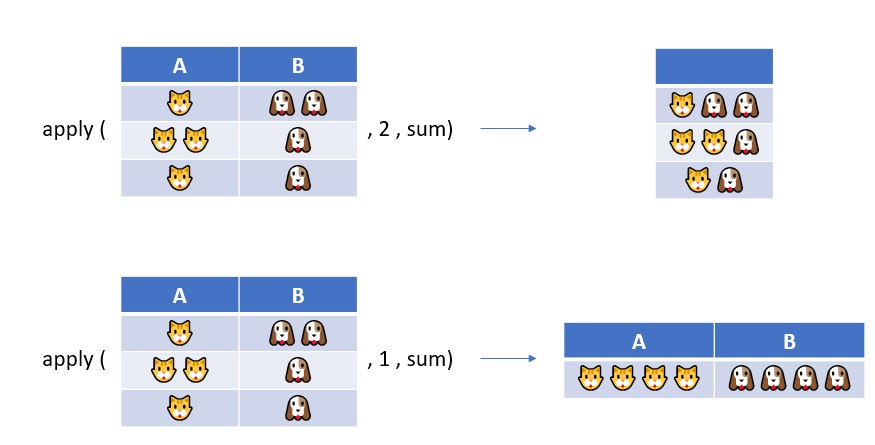

------------------------------------------------------------------------

用`apply`家族與`aggregate`計算

`apply`家族是R用來取代迴圈的一個函數，下圖是一個簡單釋例

{width = 300}

`apply`包含三個參數，第一個是傳入data.frame、第二為函數方向(1為上到下；2為左到右)、第三是計算函數，像上圖就是加總(sum)。

```{r}
# 各數值平均
# 因為第5欄是品種名稱，所以選取1~4欄[1:4]計算
apply(iris[1:4] ,2, mean)
```

`apply`家族成員的功能不同

`apply`: 因為要輸入三個變數，使用頻率因此比較低

`lapply`: l代表list，`apply`算完回傳的物件會存成list

`sapply`: s代表 simplify，回傳的物件是簡化的向量(vector)，`vapply`功能與其類似

`mapply`: m代表multivariate，意思是可以同時使用多個變數

`tapply`: 可以計算分組，第二個參數是分組index


如果要做分組平均就比較麻煩，先用`split`分開將表格依品種切開，再來計算
```{r}
# split 根據品種分組
split(iris , iris$Species)

# split 切開表格產生的list，將list物件依序利用colMeans計算各column平均
myList <- split(iris , iris$Species)
lapply( myList, function(x) colMeans(x[1:4]))
```

上面用到匿名函數(anonymous function)的概念。

lapply將myList拆成myList[[1]] myList[[2]] myList[[3]] ，一個一個傳到後面的function(x)中

當 x =` myList[[1]]`時，程式執行`colMeans(x[1:4]))`，也就是將`myList`第1個物件的第1到第4行進行欄位平均`colMeans`。這個函數只存在lapply內，執行完成就消失，所以稱為匿名函數。


上述資料是根據'Species'進行分組平均，如果是多組的話就要新增欄位再切再算...聽起來好麻煩。

R內建的`aggregate`函數可以用來完成根據分組、多統計量的計算。
```{r}
# 多觀測直分多組計算
data(mtcars)
aggregate( . ~ vs+am,
           data=mtcars,
           mean)
```

多函數計算
```{r}
# 多對多分組計算

aggregate( . ~ vs+am, data = mtcars,
           FUN= function(x) c("mean"= round(mean(x),2), 
                              'N'   = round(length(x),2), 
                              "median" = round(median(x),2),
                              "SD"  = round(sd(x),2),
                              "CV"  = round(sd(x) / mean(x),2) ))
```


這三個結果可以直接輸出

```{r eval=FALSE, include=FALSE}
write.csv(sumList , 'D:/summary.csv')
```
